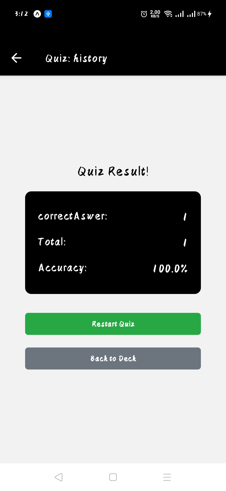

# Mobile Flashcards

For the Mobile Flashcards project, that allows users to study collections of flashcards. The app will allow users to create different categories of flashcards called "decks", add flashcards to those decks, then take quizzes on those decks.
It uses React Native, Expo, Redux, & React Navigation & Native Base.


# Android Screenshots
  

  


## Installation

1-Download project
</br>
2-Use npm or yarn install the  dependencies.
3-The project can be run with npm or yarn

- `expo start` or `yarn start`

## Testing Platforms

- Android 10 [RealMe xt]
- iOS 12 [iPhone 8 Simulator]

## The key functionalities are:

* ```List All Deck```
  - lists all decks of flashcards with their title and number of flashcards
* ```Create New Deck```
  - simple text input form for adding a new deck
* ```Deck details```
  - shows the title of the deck and the number of cards in it
  - user can add a card, start a quiz or delete the deck
* ```Create New card```
  - user can add a new card to the selected deck
* ```Quiz```
  - the app takes the user through all the flashcards
  - the user can click on show answer to see the answer
  - the app counts the number of correct answers
* ```Results```
  -  at the end of the quiz , it calculated the number of correct answers and shows it to the user
  -  button to restart the quiz and a button to return to the Deck details page
  


